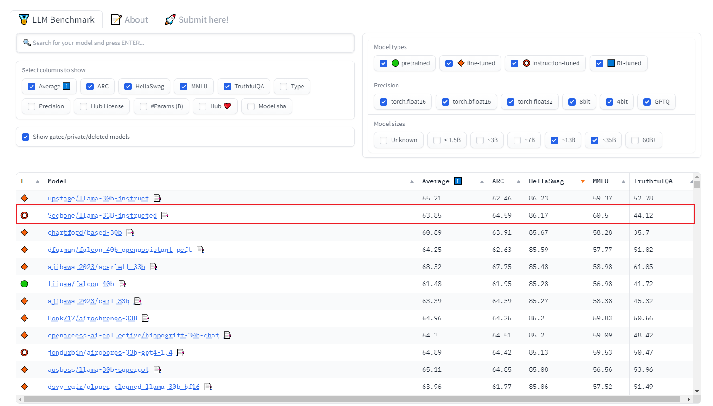

# NeurIPS Submission #1
=======================
- my mail:1413786269@qq.com
- collaborator:Secbone(https://github.com/Secbone)  mail:secbone@gmail.com

### Instructions for Running

IMPORTANT: Due to network constraints, I was unable to test the download_weights.py script. If you encounter any issues with this script, you can manually download the weights from this link on Hugging Face.
https://huggingface.co/Secbone/llama-33B-instructed/tree/main

Our model achieved a high score on the Openllm leaderboard, and you are encouraged to use it for reference.

### About Our Submission
Instead of relying on the official sample submission code, we opted for a transformers-based approach with greedy search generation. We have experimented with different parameters and found that setting the repetition penalty to 1.15 yielded superior results, although its necessity remains a topic of further exploration.

### Methodology
We adopted the llama-30b as our foundational model and integrated a novel technique to align the model more closely with user intents. The training duration was 23 hours, at the end of which we observed commendable results.

Our model's performance has been showcased on the Openllm Leaderboard, with the results visible below:

Our model boasts top scores in the arc/ellaswag/MMLU categories. However, it's worth noting that our scores were relatively lower in the TruthfulQA test.
