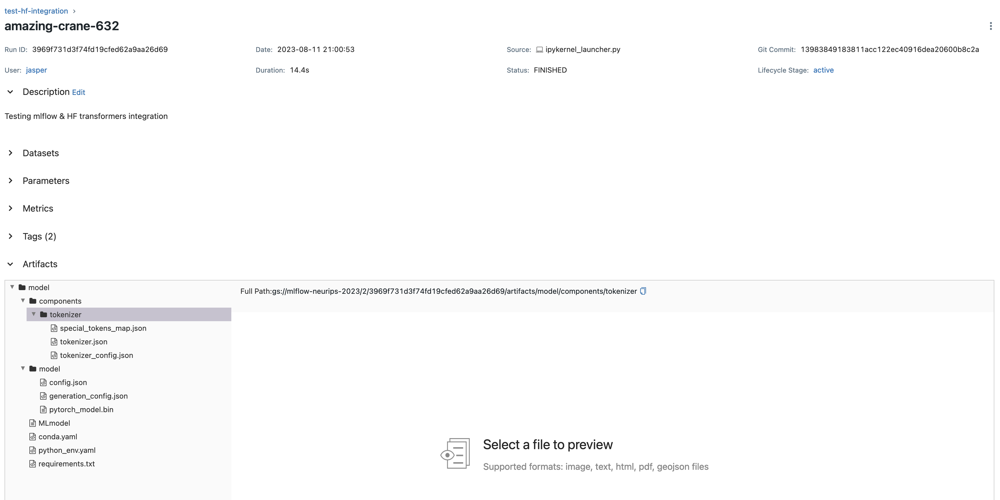

# Investigating HELM model loading

Run HELM with a local model (see https://github.com/stanford-crfm/helm/issues/1742)

General setup for local models with HELM:

1. Need the flag `--enable-local-huggingface-models <PATH-TO-MODEL>` to be set when calling `helm-run`. On a K8s pod,
this is always '/scratch/<MODEL-FOLDER>'. See 'jobs/evaluation/example.mlflow.job_config.yml'.
1. Need to refer to the model in 'run_specs.conf' as 'huggingface/<MODEL-NAME>'. For example, if the model is in the
directory '/scratch/models/roberta-base', then the entry in 'run_specs.conf' should be 'huggingface/roberta-base'.
See 'jobs/evaluation/opt_350_run_specs.conf'.

## Using model weights stored on GCS

To use a model stored on GCS, you need to download the model weights to the kubernetes pod. All you need to do is to
refer to the correct folder in your evaluation config file. For example:

```yaml
version: v2
image: "europe-west4-docker.pkg.dev/neurips-llm-eff-challenge-2023/container-registry-neurips-2023/evaluation"
image_tag: "latest"
compute_config:
  accelerator: "nvidia-tesla-t4"
  cpu: "4"
  memory: "16Gi"
helm:
  args:
    - "--max-eval-instances"
    - "10"
    - "--enable-local-huggingface-models"
    - "/scratch/opt-350"
  suite: "v1"
mlflow_config:
  tracking_uri: "http://10.164.0.15:5000" # http://34.90.207.177:5000
model_config:
  gs_uri: "gs://data-neurips-2023/weights/opt-350"
tracking_config:
  experiment_name: eval-test-debug
  # See https://yaml-multiline.info/. Only '>' is supported here.
  description: >
    This evaluation runs HELM on a base opt-350 model stored on GCS <https://huggingface.co/facebook/opt-350m/tree/main>.
  tags:
    model: Opt-350
    creator: Jasper
    datasets:
      - dolly
      - dataset2
    lifecycle: experimental
```

For GCS urls, a path such as 'gs://path/to/model' is downloaded to '/scratch/model'.

## Using model weights stored on MLFlow

You can refer to model weights that are tracked by MLFlow by specifying the 'mlflow_artifact' options under 'model_config'.
This will download the model weights to the kubernetes pod. For example:

```yaml
version: v4
image: europe-west4-docker.pkg.dev/neurips-llm-eff-challenge-2023/container-registry-neurips-2023/evaluation
image_tag: latest
compute_config:
  accelerator: nvidia-tesla-t4
  cpu: "4"
  memory: "16Gi"
helm:
  args:
    - "--max-eval-instances"
    - "10"
    - "--enable-local-huggingface-models"
    - "/scratch/model/model"
  suite: "v1"
mlflow_config:
  tracking_uri: "http://10.164.0.15:5000"
model_config:
  mlflow_artifact:
    run_id: "3969f731d3f74fd19cfed62a9aa26d69"
    artifact_path: model
    model_directory: model
    # tokenizer_directory: components/tokenizer
    tokenizer_hf_repo: "EleutherAI/pythia-70m"
tracking_config:
  experiment_name: eval-test-debug
  # See https://yaml-multiline.info/. Only '>' is supported here.
  description: >
    This evaluation runs HELM on a base pythia-70m model stored in MLFlow <https://huggingface.co/EleutherAI/pythia-70m>.
  tags:
    model: Pythia-70m
    creator: Jasper
    datasets:
      - dolly
      - dataset2
    lifecycle: experimental
```

The above configuration will download artifacts from the MLFlow run with id '3969f731d3f74fd19cfed62a9aa26d69'
that are stored in the artifact path 'model'.



We also specify that the model weights are stored in the 'model' directory
and that the evaluation job should download the tokenizer from the HuggingFace repository 'EleutherAI/pythia-70m'.
If you also store the tokenizer using MLFlow, you can specify the 'tokenizer_directory' option instead. You can leave
both options empty if all artifacts can be found in the same folder.

## Models attempted

### Llama-2-7B

Weights: gs://data-neurips-2023/weights/TinyPixel-Llama-2-7B-bf16-sharded

Cmd

```
helm-run \
    --enable-local-huggingface-models /scratch/TinyPixel-Llama-2-7B-bf16-sharded \
    --run-specs boolq:model=huggingface/TinyPixel-Llama-2-7B-bf16-sharded \
    --suite v1 \
    --max-eval-instances 1
```

FAILURE: This yields an exit code 137 (OOM) with tesla t4

### Opt-350

Weights: gs://data-neurips-2023/weights/opt-350

Conf

```text
entries: [{description: "mmlu:subject=philosophy,model=huggingface/opt-350", priority: 1}]
```

Cmd

```
helm-run --enable-local-huggingface-models /scratch/opt-350 --run-specs boolq:model=huggingface/opt-350 --suite v1 --max-eval-instances 100
```

Succes!

Cmd

```
helm-run --enable-local-huggingface-models /scratch/opt-350 --conf-paths run_specs.conf --suite v1 --max-eval-instances 100
```

Succes!
