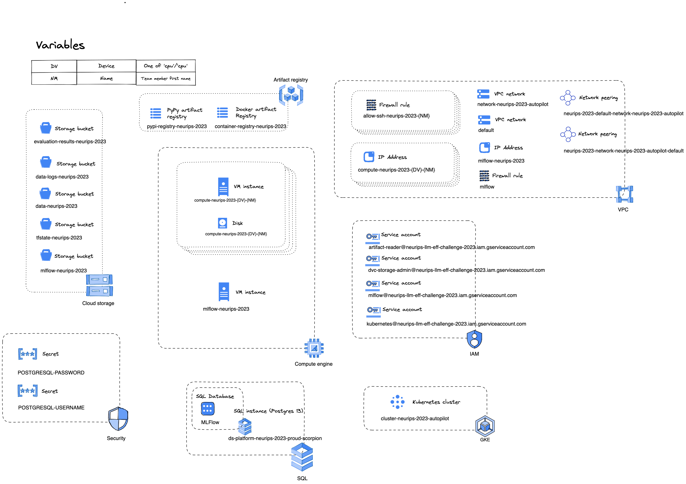
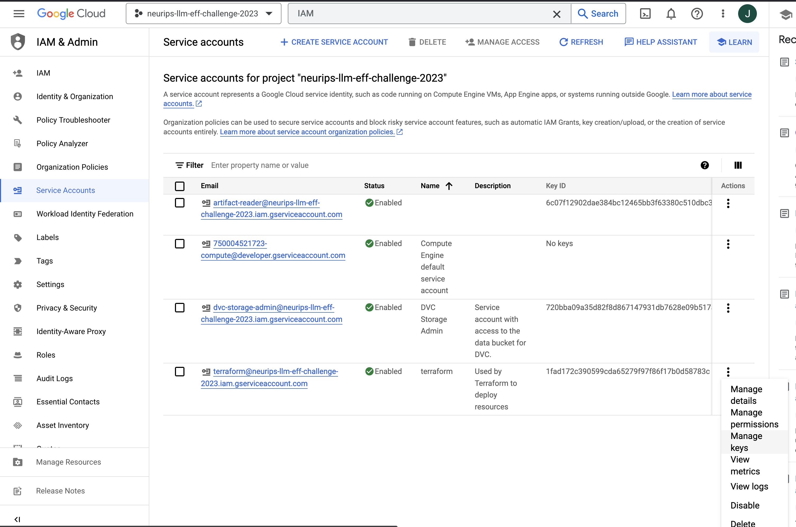
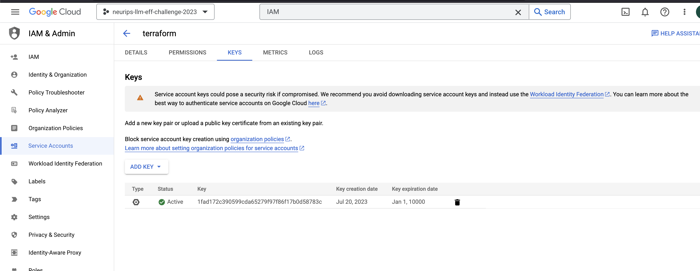
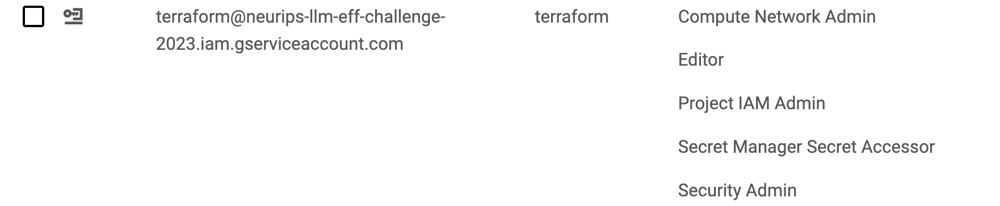

# Infrastructure



## Setting up

1. Create project on GCP
2. Create bucket for tfstate
3. Create service account & download JSON key. Put in ../.secrets
4. Update `providers.tf` with location

### gcloud

1. `gcloud config configurations create neurips`
1. `gcloud config set project neurips-llm-eff-challenge-2023`
1. `gcloud config set account jasper.ginn@xebia.com`
1. `gcloud config set compute/region europe-west4`
1. `gcloud config set compute/zone europe-west4-a`
1. `gcloud auth login` (optional)

Then (if switched back to another account): `gcloud config configurations activate neurips`

### Terraform

Ensure storage API is configured: `gcloud services enable storage.googleapis.com`

Ensure cloud resource managaer API is configured: `gcloud services enable cloudresourcemanager.googleapis.com`

In the GCP project, go to IAM > Service Accounts > Select the terraform service account and click "Manage Keys".



Add a JSON key, download it to the a folder called '.secrets' in the root directory.



Ensure that the terraform account has the following permissions



### Python dev tools

I've added some [invoke](https://www.pyinvoke.org/) commands to `tasks.py`. You can call these as follows, e.g. `invoke tf-plan`. See `invoke --list` for a full list of the commands.

## Logging into your compute development environment

Each one of you has a CPU and a GPU Compute VM on which to develop. To do this, download the VSCode Remote - SSH extension.

### First-time setup

You need to do this for the CPU and the GPU machines separately.

Ensure that you are using the poetry shell `poetry shell`

1. Go into the "infra" folder and execute `invoke write-gcp-compute-ssh-key <YOUR-FIRST-NAME>`
1. SSH into the compute enviroment `ssh -i ../.secrets/.ssh/id_rsa <YOUR-FIRST-NAME>@<IP-ADDRESS>`. You can find the IP address in the generated `ssh_compute_config` in the root folder.
1. (GPU-only) When you are prompted to install the NVIDIA drivers, hit 'y' and <ENTER>
1. Fix permissions on the external disk `sudo chmod a+w /home/jupyter`
1. Exit the VM
1. In VSCode, hit "COMMAND + SHIFT + P" and select "Remote-SSH: Connect to Host"
1. In the configuration pane, select "Configure SSH Hosts > Settings"
1. In the "Remote.SSH: Config File", add the path to the generated SSH config file "PATH/TO/GIT/REPO/neurips-llm-efficiency-challenge/ssh_compute_config" (e.g. "/Users/user/Documents/CodeProjects/neurips-llm-efficiency-challenge-2023/neurips-llm-efficiency-challenge/ssh_compute_config").

Note if logged into the VM before but the VM has been redeployed, it might result in an error like this:

```
@@@@@@@@@@@@@@@@@@@@@@@@@@@@@@@@@@@@@@@@@@@@@@@@@@@@@@@@@@@
@    WARNING: REMOTE HOST IDENTIFICATION HAS CHANGED!     @
@@@@@@@@@@@@@@@@@@@@@@@@@@@@@@@@@@@@@@@@@@@@@@@@@@@@@@@@@@@
IT IS POSSIBLE THAT SOMEONE IS DOING SOMETHING NASTY!
Someone could be eavesdropping on you right now (man-in-the-middle attack)!
It is also possible that a host key has just been changed.
The fingerprint for the ED25519 key sent by the remote host is
SHA256:....
Please contact your system administrator.
Add correct host key in /Users/YOUR_NAME/.ssh/known_hosts to get rid of this message.
Offending ECDSA key in /Users/YOUR_NAME/.ssh/known_hosts:YOUR_LINE_NUMBER
Host key for YOUR_VM_IP has changed and you have requested strict checking.
Host key verification failed
```

This means that stored fingerprint of your VM no longer matches the fingerprint of the new VM. To fix this, run the following command:

```bash
ssh-keygen -R YOUR_VM_IP
```

### Using the remote compute environment

1. Hit "COMMAND + SHIFT + P" again and select "Remote-SSH: Connect to Host". Select "neurips-compute". You can now use VSCode on the remote device.
1. Use "/home/jupyter" to store files etc. that you want to persist.

Sometimes the external disk is not mounted correctly, which means that `home/jupyter` is does not exists. To fix this, do the following:

First run `lsblk` to find the name of the disk. It should be something like `/dev/sdb`. Then run the following commands:

```bash
sudo mount /dev/sda /home/jupyter
```
The `sda` might be different for you, if the disk has different name. You can check the name of the disk by running `lsblk`.

```bash

<!-- BEGIN_TF_DOCS -->
## Terraform Documentation
Below is the automatically generated Terraform documentation.

### Modules

| Name | Source | Version |
|------|--------|---------|
| <a name="module_compute-cpu"></a> [compute-cpu](#module\_compute-cpu) | ./modules/compute | n/a |
| <a name="module_compute-gpu"></a> [compute-gpu](#module\_compute-gpu) | ./modules/compute | n/a |
| <a name="module_cpu-compute-configure"></a> [cpu-compute-configure](#module\_cpu-compute-configure) | ./modules/compute_configure | n/a |
| <a name="module_docker-registry"></a> [docker-registry](#module\_docker-registry) | ./modules/docker_artifact_store | n/a |
| <a name="module_gpu-compute-configure"></a> [gpu-compute-configure](#module\_gpu-compute-configure) | ./modules/compute_configure | n/a |
| <a name="module_kubernetes"></a> [kubernetes](#module\_kubernetes) | ./modules/kubernetes | n/a |
| <a name="module_mlflow"></a> [mlflow](#module\_mlflow) | ./modules/mlflow | n/a |
| <a name="module_peering"></a> [peering](#module\_peering) | terraform-google-modules/network/google//modules/network-peering | n/a |
| <a name="module_pypi-registry"></a> [pypi-registry](#module\_pypi-registry) | ./modules/pypi_artifact_store | n/a |
| <a name="module_services"></a> [services](#module\_services) | ./modules/services | n/a |
| <a name="module_sql"></a> [sql](#module\_sql) | ./modules/sql | n/a |
| <a name="module_storage"></a> [storage](#module\_storage) | ./modules/cloud_storage | n/a |

### Resources

| Name | Type |
|------|------|
| [google_compute_address.static_ip](https://registry.terraform.io/providers/hashicorp/google/latest/docs/resources/compute_address) | resource |
| [google_compute_firewall.allow_ssh](https://registry.terraform.io/providers/hashicorp/google/latest/docs/resources/compute_firewall) | resource |
| [google_compute_firewall.mlflow-access](https://registry.terraform.io/providers/hashicorp/google/latest/docs/resources/compute_firewall) | resource |
| [google_project_iam_binding.this](https://registry.terraform.io/providers/hashicorp/google/latest/docs/resources/project_iam_binding) | resource |
| [google_project_iam_member.artifact-reader](https://registry.terraform.io/providers/hashicorp/google/latest/docs/resources/project_iam_member) | resource |
| [google_project_iam_member.artifact-writer](https://registry.terraform.io/providers/hashicorp/google/latest/docs/resources/project_iam_member) | resource |
| [google_secret_manager_secret.credentials](https://registry.terraform.io/providers/hashicorp/google/latest/docs/resources/secret_manager_secret) | resource |
| [google_secret_manager_secret_version.credentials](https://registry.terraform.io/providers/hashicorp/google/latest/docs/resources/secret_manager_secret_version) | resource |
| [google_service_account.artifact-writer](https://registry.terraform.io/providers/hashicorp/google/latest/docs/resources/service_account) | resource |
| [google_service_account.data-storage-admin](https://registry.terraform.io/providers/hashicorp/google/latest/docs/resources/service_account) | resource |
| [google_service_account_key.artifact-writer](https://registry.terraform.io/providers/hashicorp/google/latest/docs/resources/service_account_key) | resource |
| [google_service_account_key.data-storage-admin](https://registry.terraform.io/providers/hashicorp/google/latest/docs/resources/service_account_key) | resource |
| [google_storage_bucket_iam_member.compute-data-bucket-object-creator](https://registry.terraform.io/providers/hashicorp/google/latest/docs/resources/storage_bucket_iam_member) | resource |
| [google_storage_bucket_iam_member.compute-data-bucket-user](https://registry.terraform.io/providers/hashicorp/google/latest/docs/resources/storage_bucket_iam_member) | resource |
| [google_storage_bucket_iam_member.compute-mlflow-bucket-object-creator](https://registry.terraform.io/providers/hashicorp/google/latest/docs/resources/storage_bucket_iam_member) | resource |
| [google_storage_bucket_iam_member.compute-mlflow-bucket-user](https://registry.terraform.io/providers/hashicorp/google/latest/docs/resources/storage_bucket_iam_member) | resource |
| [google_storage_bucket_iam_member.data-storage-admin](https://registry.terraform.io/providers/hashicorp/google/latest/docs/resources/storage_bucket_iam_member) | resource |
| [google_storage_bucket_iam_member.gke-data-bucket-reader](https://registry.terraform.io/providers/hashicorp/google/latest/docs/resources/storage_bucket_iam_member) | resource |
| [google_storage_bucket_iam_member.gke-evaluation-bucket-admin](https://registry.terraform.io/providers/hashicorp/google/latest/docs/resources/storage_bucket_iam_member) | resource |
| [google_storage_bucket_iam_member.gke-mlflow-bucket-object-creator](https://registry.terraform.io/providers/hashicorp/google/latest/docs/resources/storage_bucket_iam_member) | resource |
| [google_storage_bucket_iam_member.gke-mlflow-bucket-reader](https://registry.terraform.io/providers/hashicorp/google/latest/docs/resources/storage_bucket_iam_member) | resource |
| [google_client_config.default](https://registry.terraform.io/providers/hashicorp/google/latest/docs/data-sources/client_config) | data source |
| [google_compute_network.default](https://registry.terraform.io/providers/hashicorp/google/latest/docs/data-sources/compute_network) | data source |
| [google_compute_network.kubernetes](https://registry.terraform.io/providers/hashicorp/google/latest/docs/data-sources/compute_network) | data source |
| [google_secret_manager_secret_version.basic](https://registry.terraform.io/providers/hashicorp/google/latest/docs/data-sources/secret_manager_secret_version) | data source |

### Inputs

| Name | Description | Type | Default | Required |
|------|-------------|------|---------|:--------:|
| <a name="input_admins"></a> [admins](#input\_admins) | List of IAM members that will be granted the roles/owner IAM role | `list(string)` | n/a | yes |
| <a name="input_compute_persistent_disk_size_gb"></a> [compute\_persistent\_disk\_size\_gb](#input\_compute\_persistent\_disk\_size\_gb) | Size of the persistent disk in GB | `number` | n/a | yes |
| <a name="input_compute_persistent_disk_type"></a> [compute\_persistent\_disk\_type](#input\_compute\_persistent\_disk\_type) | Type of the persistent disk (e.g. 'pd-balanced') | `string` | n/a | yes |
| <a name="input_deploy_cpu_compute"></a> [deploy\_cpu\_compute](#input\_deploy\_cpu\_compute) | Deploy CPU compute engine work stations | `bool` | `false` | no |
| <a name="input_deploy_gpu_compute"></a> [deploy\_gpu\_compute](#input\_deploy\_gpu\_compute) | Deploy GPU compute engine work stations | `bool` | `false` | no |
| <a name="input_gcp_project"></a> [gcp\_project](#input\_gcp\_project) | GCP project name | `string` | n/a | yes |
| <a name="input_gcp_project_id"></a> [gcp\_project\_id](#input\_gcp\_project\_id) | GCP project ID | `string` | n/a | yes |
| <a name="input_gcp_region"></a> [gcp\_region](#input\_gcp\_region) | value of the region to deploy to | `string` | n/a | yes |
| <a name="input_gcp_zone"></a> [gcp\_zone](#input\_gcp\_zone) | value of the zone to deploy to | `string` | n/a | yes |
| <a name="input_mlflow_whitelist_ips"></a> [mlflow\_whitelist\_ips](#input\_mlflow\_whitelist\_ips) | List of IP addresses to add to the firewall whitelist rule for the MLFlow server. | `list(string)` | n/a | yes |
| <a name="input_prefix"></a> [prefix](#input\_prefix) | Unique identifier that is postpended to all resources. | `string` | n/a | yes |
| <a name="input_sql_user"></a> [sql\_user](#input\_sql\_user) | Name of the SQL user | `string` | n/a | yes |
| <a name="input_users"></a> [users](#input\_users) | List of users for which compute engines will be created | <pre>map(list(object({<br>    machine_type       = string<br>    guest_accelerator  = string<br>    ssh_username       = optional(string)<br>    boot_disk_image    = optional(string)<br>    boot_disk_snapshot = optional(string)<br>    zone               = optional(string)<br>  })))</pre> | n/a | yes |

### Outputs

| Name | Description |
|------|-------------|
| <a name="output_compute-cpu"></a> [compute-cpu](#output\_compute-cpu) | Details needed to connect to the CPU compute instance |
| <a name="output_compute-gpu"></a> [compute-gpu](#output\_compute-gpu) | Details needed to connect to the GPU compute instance |
| <a name="output_data-bucket-name"></a> [data-bucket-name](#output\_data-bucket-name) | Name of the 'data' bucket that can be used to store data. |
| <a name="output_data-bucket-service-account"></a> [data-bucket-service-account](#output\_data-bucket-service-account) | Service account email that can be used to read/write data to the 'data' bucket |
| <a name="output_docker-registry-name"></a> [docker-registry-name](#output\_docker-registry-name) | Name of the docker artifact registry. |
| <a name="output_pods_ip_range"></a> [pods\_ip\_range](#output\_pods\_ip\_range) | n/a |
| <a name="output_pypi-registry-name"></a> [pypi-registry-name](#output\_pypi-registry-name) | Name of the pypi artifact registry. |
<!-- END_TF_DOCS -->
