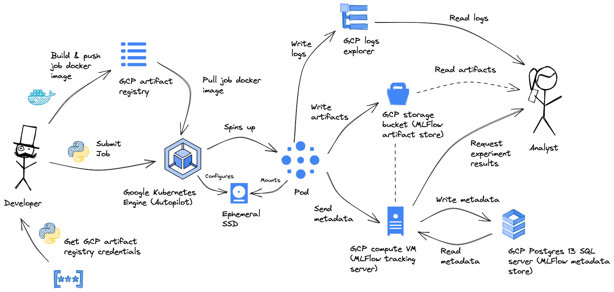
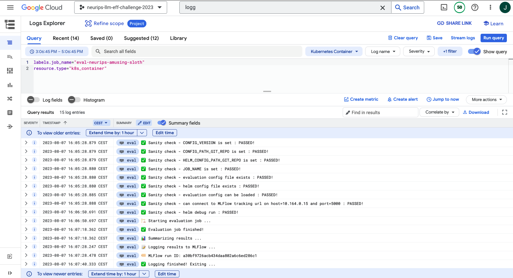

# Jobs

You can run evaluation & training jobs by submitting them to the GKE autopilot cluster.

## Setup

1. Install the cajajejo library with 'evaluation' extras: `poetry install -E evaluation`
1. Install [kubectl](https://kubernetes.io/docs/tasks/tools/install-kubectl-macos/)
1. Update the gcloud SDK: `brew upgrade --cask google-cloud-sdk`
1. Install the GKE cloud plugin: `gcloud components install gke-gcloud-auth-plugin`
1. Authenticate with the gcloud GKE cluster (make sure to activate poetry shell `poetry shell`): `invoke authenticate-kubectl`

## Training jobs

NOT YET STARTED

## Evaluation jobs



### Evaluation job docker image

The evaluation job docker image can be found in the root folder of this repository ('evaluation.Dockerfile'). The evaluation job copies and pip installs the cajajejo python module with 'evaluation' extras (see 'pyptoject.toml')
You should rebuild it only if:

- You changed the CLI in 'jobs/evaluation/cli.py'
- You updated the dependencies for the evaluation job by executing `poetry add ...`.
- You updated relevant code in 'src/cajajejo'

**Be mindful of dependencies**: the HELM dependency is not added to poetry because it contains many dependencies itself. The downside of this is that dependencies added to the poetry project may clash with HELM dependencies. (e.g. this is why we specify 'pydantic<2').

To rebuild the image & push it to the GCP artifact registry, go to the root folder

If you have not yet authenticated with the registry/docker, do so by executing:

```
invoke docker-login
```

Now, execute:

```
invoke build-and-push-job-image evaluation
```

### Running the docker image locally

You can run the docker image locally by executing:

```
docker run \
   --mount type=bind,src="$(pwd)/jobs/evaluation/debug.job_config.yml,target=/etc/configs/eval_config.yml" \
   --mount type=bind,src="$(pwd)/jobs/evaluation/app/debug.conf,target=/etc/configs/run_specs.conf" \
   --mount type=tmpfs,destination=/scratch \
   -e CONFIG_VERSION=debug \
   -e HELM_CONFIG_PATH_GIT_REPO=jobs/evaluation/app/debug.conf \
   -e CONFIG_PATH_GIT_REPO=jobs/evaluation/debug.job_config.yml \
   -e JOB_NAME=debug \
   neurips/evaluation \
   evaluate --local
```

This will mount the debug job config and the debug HELM config to the docker container. The debug eval job uses a local mlflow instance for tracking results.

To boot into the docker container, execute:

```
docker run -it --entrypoint /bin/bash \
   --mount type=bind,src="$(pwd)/jobs/evaluation/debug.job_config.yml,target=/etc/configs/eval_config.yml" \
   --mount type=bind,src="$(pwd)/jobs/evaluation/app/debug.conf,target=/etc/configs/run_specs.conf" \
   --mount type=tmpfs,destination=/scratch \
   -e CONFIG_VERSION=debug \
   -e HELM_CONFIG_PATH_GIT_REPO=jobs/evaluation/app/debug.conf \
   -e CONFIG_PATH_GIT_REPO=jobs/evaluation/debug.job_config.yml \
   -e JOB_NAME=debug \
   neurips/evaluation
```

#### Running tests

Pytest runs automatically when building the docker image. You can also run tests manually by executing:

```
docker run \
   --mount type=tmpfs,destination=/scratch \
   -e CONFIG_VERSION=debug \
   -e HELM_CONFIG_PATH_GIT_REPO=jobs/evaluation/app/debug.conf \
   -e CONFIG_PATH_GIT_REPO=jobs/evaluation/debug.job_config.yml \
   -e JOB_NAME=debug \
   neurips/evaluation test
```

### Generating the kubernetes evaluation job spec

To deploy the evaluation job on kubernetes, you need the following:

- An evaluation job config file: this is a yaml file that contains the configuration for the evaluation job. See
- 'jobs/evaluation/example.gcs.job_config.yml' or 'jobs/evaluation/example.gcs.job_config.yml' for an example. The
- Job config must adhere to the pydantic class found in 'src/cajajejo/config.py'. TODO: **it's probably a good idea
- to use a specific commit hash instead of 'latest'**. This config file should take the following fields:

  - version: Specifies the version of the configuration file.
  - image: Specifies the Docker image to be used for evaluation.
  - image_tag: Specifies the tag of the Docker image.
  - compute_config: Specifies the configuration for the compute resources.
    - accelerator: Specifies the type of accelerator to be used.
    - cpu: Specifies the number of CPUs to be allocated.
    - memory: Specifies the amount of memory to be allocated.
  - helm: Specifies the configuration for the Helm chart.
    - args: Specifies the arguments to be passed to the Helm chart.
    - suite: Specifies the suite version of the Helm chart.
  - mlflow_config: Specifies the configuration for MLflow.
    - tracking_uri: Specifies the URI of the MLflow tracking server.
  - model_config: Specifies the configuration for the model.
    - mlflow_artifact: Specifies the MLflow artifact details.
      - run_id: Specifies the MLflow run ID.
      - artifact_path: Specifies the path to the model artifact.
      - model_directory: Specifies the directory of the model.
      - tokenizer_directory: Specifies the directory of the tokenizer.
    - gs_uri (mutually exclusive with mlflow_artifact): Specifies the URI
      of the huggingface model artifact on GCS.
  - tracking_config: Specifies the configuration for tracking.
    - experiment_name: Specifies the name of the experiment.
    - description: Specifies the description of the evaluation.
    - tags: Specifies the tags for the evaluation.

- A HELM configuration file: see [HELM docs](https://crfm-helm.readthedocs.io/en/latest/tutorial/) for documentation. See comprehensive example [here](https://github.com/stanford-crfm/helm/blob/main/src/helm/benchmark/presentation/run_specs.conf).
- A kubernetes job spec: this is a yaml file that contains the kubernetes job configuration. You should generate this using the cajajejo CLI. Execute `cajajejo jobs evaluation parse-job --help` for more information.

Example generation:

```
cajajejo jobs evaluation parse-job \
    jobs/evaluation/jasper.job_config.yml \
    jobs/evaluation/app/run_specs.conf \
    jobs/evaluation/jasper_eval_job.yml
```

The k8s job spec does the following:

1. Uses jinja to generate a k8s job spec from the evaluation job config file.
2. Add the evaluation job config file and HELM config file as config maps to the k8s job spec.
3. The config maps are mounted as files on the docker container.

You probably want to check in/version control these jobs because they can refer to specific hashes of the docker image. This is useful if you want to reproduce results.

Below, you can find an example of a parsed job spec:

```yaml
apiVersion: batch/v1
kind: Job
metadata:
  name: eval-neurips-merciful-crocodile
  namespace: default
spec:
  ttlSecondsAfterFinished: 1800
  backoffLimit: 3
  template:
    spec:
      serviceAccountName: kubernetes
      nodeSelector:
        # iam.gke.io/gke-metadata-server-enabled: "true" # Only for workload identity:
        # See: https://cloud.google.com/kubernetes-engine/docs/how-to/autopilot-gpus
        cloud.google.com/gke-accelerator: nvidia-tesla-t4
      # From: https://getindata.com/blog/deploy-open-source-llm-private-cluster-hugging-face-gke-autopilot/
      initContainers:
      - name: init
        image: europe-west4-docker.pkg.dev/neurips-llm-eff-challenge-2023/container-registry-neurips-2023/mlflow-skinny-gcp:da958c6a7e
        # Output path: /scratch/<GS-FOLDER-NAME>
        env:
        - name: MLFLOW_TRACKING_URI
          value: "http://10.164.0.15:5000"
        command: ["mlflow"]
        args: ["artifacts", "download", "-r", "3969f731d3f74fd19cfed62a9aa26d69", "-a", "model", "-d", "/scratch"]
        volumeMounts:
        - mountPath: "/scratch"
          name: scratch-volume
      containers:
      - name: eval
        image: europe-west4-docker.pkg.dev/neurips-llm-eff-challenge-2023/container-registry-neurips-2023/evaluation:latest
        command: ["python3", "cli.py"]
        args: ["--trace", "evaluate"]
        env:
        - name: CONFIG_PATH_GIT_REPO
          value: "jobs/evaluation/example.mlflow.job_config.yml"
        - name: HELM_CONFIG_PATH_GIT_REPO
          value: "jobs/evaluation/pythia_run_specs.conf"
        - name: JOB_NAME
          value: "eval-neurips-merciful-crocodile"
        - name: CONFIG_VERSION
          value: "10abfb1bf8a0fd1ff65751521daaa0cd76fbc85d"
        resources:
          limits:
            nvidia.com/gpu: "1"
          requests:
            cpu: "4"
            memory: "16Gi"
        volumeMounts:
        - name: configs-volume
          mountPath: /etc/configs
        - mountPath: "/scratch"
          name: scratch-volume
      volumes:
        - name: configs-volume
          configMap:
            name: eval-configs
        - name: scratch-volume
          ephemeral:
            volumeClaimTemplate:
              metadata:
                labels:
                  type: scratch-volume
              spec:
                accessModes: [ "ReadWriteOnce" ]
                storageClassName: "ssd"
                resources:
                  requests:
                    storage: 50Gi # TODO: make this configurable
      restartPolicy: "Never"
---
apiVersion: v1
kind: ConfigMap
metadata:
  name: eval-configs
  namespace: default
data:
  eval_config.yml: |
    compute_config:
      accelerator: nvidia-tesla-t4
      cpu: '4'
      memory: 16Gi
    helm:
      args:
      - --max-eval-instances
      - '10'
      - --enable-local-huggingface-models
      - /scratch/model/model
      suite: v1
    image: europe-west4-docker.pkg.dev/neurips-llm-eff-challenge-2023/container-registry-neurips-2023/evaluation
    image_tag: latest
    mlflow_config:
      tracking_uri: http://10.164.0.15:5000
    model_config:
      gs_uri: null
      mlflow_artifact:
        artifact_path: model
        model_directory: model
        run_id: 3969f731d3f74fd19cfed62a9aa26d69
        tokenizer_directory: null
        tokenizer_hf_repo: EleutherAI/pythia-70m
    tracking_config:
      description: >
        This evaluation runs HELM on a base pythia-70m model stored in MLFlow <https://huggingface.co/EleutherAI/pythia-70m>.
      experiment_name: eval-test-debug
      run_name: null
      tags:
        creator: Jasper
        datasets:
        - dolly
        - dataset2
        lifecycle: experimental
        model: Pythia-70m
    version: v4

  run_specs.conf: |
    # Main `RunSpec`s for the benchmarking.

    entries: [

      ##### Generic #####

      ##### Question Answering #####
      # Scenarios: BoolQ, NarrativeQA, NewsQA, QuAC
      # Scenarios: NaturalQuestions
      # Scenarios: CommonsenseQA, HellaSwag, OpenBookQA, TruthfulQA
      # Scenarios: MMLU

      ## Reading comprehension

      {description: "boolq:model=huggingface/model,data_augmentation=canonical", priority: 1}
      {description: "mmlu:model=huggingface/model,subject=abstract_algebra,data_augmentation=canonical", priority: 2}
      {description: "mmlu:model=huggingface/model,subject=anatomy,data_augmentation=canonical", priority: 3}
      {description: "mmlu:model=huggingface/model,subject=college_chemistry,data_augmentation=canonical", priority: 4}

    ]

---
# See: https://kubernetes.io/docs/concepts/storage/ephemeral-volumes/#generic-ephemeral-volumes
#  and: https://cloud.google.com/kubernetes-engine/docs/how-to/persistent-volumes/gce-pd-csi-driver#using_the_for_linux_clusters
apiVersion: storage.k8s.io/v1
kind: StorageClass
metadata:
  name: ssd
provisioner: pd.csi.storage.gke.io
volumeBindingMode: WaitForFirstConsumer
allowVolumeExpansion: true
parameters:
  type: pd-balanced # TODO: make configurable - pd-ssd for faster storage
```

Generally, a more convenient way is to use the `invoke` command listed below.

### Submitting the evaluation job to the kubernetes cluster

You can submit the evaluation job to the kubernetes cluster using either the `cajajejo` CLI, or by using an `invoke` command.

#### Using `invoke`:

To submit the evaluation job to the kubernetes cluster, execute:

```
invoke submit-evaluation-job \
   jobs/evaluation/jasper.job_config.yml \
   jobs/evaluation/app/debug.conf \
   --kubernetes-job-spec-output-path my-job.yml # Optional!
```

This will generate the kubernetes job spec and submit it to the kubernetes cluster. The job spec will be saved to
`my-job.yml` if you specify the `--kubernetes-job-spec-output-path` flag.

I strongly suggest that you use this method to submit the job to the kubernetes cluster. This is because the `invoke`
command will check if the GIT repo is dirty, retrieve the current GIT commit hash if the repo is clean, and use it to
configure an environment variable that is used as a tag in the MLFlow run. This is useful for reproducibility.

#### Using the `cajajejo` CLI

To submit the generated evaluation job spec to the kubernetes cluster, execute either:

```
cajajejo jobs evaluation submit-job \
   --job-spec-path jobs/evaluation/jasper_eval_job.yml \
   --config-version "$(git rev-parse HEAD)"
```

If you have previously generated the job config.

Or:

```
cajajejo jobs evaluation submit-job \
    --path-to-config jobs/evaluation/jasper.job_config.yml \
    --path-to-helm-config jobs/evaluation/app/run_specs.conf \
    --config-version "$(git rev-parse HEAD)"
```

If you want to run the job without generating the k8s job spec.

## What happens when you submit the job

When you submit the job, the evaluation results will be tracked on MLflow. The evaluation results will be tracked under
the experiment name specified in the evaluation job config file. The following tags are created:

   - "config_git_sha" is set to the value of the "CONFIG_VERSION" environment variable.
   - "config_path_git_repo" is set to the value of the "CONFIG_PATH_GIT_REPO" environment variable.
   - "helm_config_path_git_repo" is set to the value of the "HELM_CONFIG_PATH_GIT_REPO" environment variable.
   - "image_build_cajajejo_version" is set to the value of the "__version__" variable.
   - "model_run_id" is set to the run_id of the mlflow_artifact in config.model_config if it exists, otherwise it is set to None.
   - "model_artifact_path" is set to the artifact_path of the mlflow_artifact in config.model_config if it exists, otherwise it is set to None.
   - "model_gs_uri" is set to the value of config.model_config.gs_uri.
   - "accelerator" is set to the value of config.compute_config.accelerator.
   - "cpu" is set to the value of config.compute_config.cpu.
   - "memory" is set to the value of config.compute_config.memory.
   - "helm_args" is set to a string representation of the config.helm.args list, joined by spaces.
   - "image" is set to the value of config.image.
   - "image_tag" is set to the value of config.image_tag.
   - "job_name" is set to the value of the "JOB_NAME" environment variable.

Three artifacts are logged using the mlflow.log_artifact() function. The artifacts being logged are:

   - helm_run_output_path
   - eval_config_path
   - helm_config_path

## Viewing the logs of your job

The logs of your job can be accessed on GCP. You can also filter for your job name there.



You can also use the `invoke` command to view (and optionally write to disk) these logs. For example, with a job called "eval-neurips-amusing-sloth", you can execute:

```
invoke get-job-logs \
   eval-neurips-amusing-sloth \
   --shift-unit days \
   --shift-amount 3 \
   --output-path .tmp/logs.json
```

The job name is partially randomly generated (see the jinja template in src/cajajejo/templates). You can find it on the parsed job spec (see above) and when executing `kubectl get jobs` after submitting a job (see above).

Execute `invoke --help get-job-logs` for more information.
